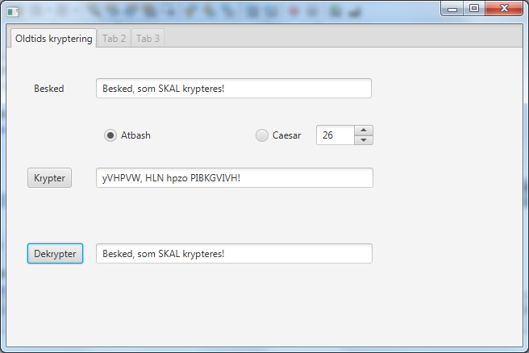

# Ciphers
## Introduction
Fra VOP F16 Eksamen - 10. juni 2016

**Vigtigt**: Der kan være problemer med at eksekvere klasser med en main()-metode under et JavaFx projekt.
Brug Shift-F11 eller højre klik på projektet og vælg Clean and Build, inden run kaldes direkte på en Java main
klasse.

**Hint**: Giv dig tid til at gennemlæse hele opgavesættet, inden du går i gang med løsningerne. Du bør dog
starte med at opsætte projektet, som beskrevet i Opgave 1.

## Tasks
### Task 1  - Oprettelse af JavaFX Projekt
**Formål**: At oprette eksamensprojektet som en JavaFX applikation, navngivet korrekt og forberedt til de øvrige eksamensopgaver.

1. Projektet er sat op på forhånd til JavaFX via Maven. Afhængigheder skal dog indlæses - dette kan gøres fra _Maven_ fanen i højre side af IntelliJ og dernæst ved at klikke på reload ikonet.


2. Start SceneBuilderen ved at dobbeltklikke på den dannede FXML-fil (_src/resources/primary.fxml_).

### Task 2 - Implementering af hierarki til oldtids-kryptering af tekster
**Baggrund**: Behovet for at sende meddelelser, som kun kan læses af den modtager meddelelsen er stilet til, har eksisteret siden oldtiden. I denne opgave skal der programmeres to sådanne historiske krypteringsalgoritmer (på engelsk ciphers):

- `AtbashCipher`: Stammer fra ca. år 500 f.kr, hvor det blev benyttet med det hebraiske alfabet. Ideen er at udskifte 1. tegn i alfabetet med det sidste, 2. tegn med det næstsidste, 3. tegn med det
  3.-sidste osv.
 
 - `CaesarCipher`: Blev opfundet under Julius Cæsar (100 f.kr – 44 f.Kr.). Fremgangsmåden er at alle bogstaver i den originale meddelelse udskiftes med et bogstav, som ligger et givet antal pladser (nøglen) længere nede i alfabetet modulus alfabetets længde.

**Klassediagam**:


**Udleveret kode**:
- `CipherInterface.java`: Konstanten ALPHABET er et array af char, indeholdende både
små og store bogstaver fra det engelske alfabet. Arrayet skal opfattes som værende cirkulært, dvs.
efter sekvensen …., 'y', 'Y', 'z', 'Z' følger 'a', 'A', 'b', 'B', ….
Derudover erklæres metoder til kryptering og dekryptering af en String.
- `CipherDriver.java`: Driverklasse til test uden brugerflade (opgave a, b og c)

## Task 2a - AbstractCipher
Opret en __abstrakt klasse__, som implementerer `CipherInterface`. Klassen skal _ikke_ implementere de to metoder fra interfacet, men indeholde en metode, som de konkrete klasser kan benytte til at finde hvilket index et givet bogstav ligger på i ALPHABET. Metoden skal have signaturen 
```
<synlighed> int findCharIndex(char ch){…}
```
, hvor `<synlighed>` skal sikre at metoden kun kan kaldes fra sub-klasser til `AbstractCipher`.
Metoden skal returnere det `index`, som `ch` findes på i arrayet, eller `-1`, hvis `ch` ikke er et bogstav i alfabetet.

## Task 2b - AtbashCipher
Denne klasse skal arve `AbstractCipher`. Implementer de to metoder fra interfacet, så:
- `public String encrypt(String message)` returnerer `message` krypteret, således at alle
_alfabetiske_ tegn i `message` er skiftet ud (’`a`’ -> ’`Z`’, ’`A`’-> ’`z`’, ’`b`’ -> ’`Y`’, osv.). _Ikkealfabetiske_ tegn, skal ikke ændres.
- `public String decrypt(String encrypted)` genskaber den originale message. _Hint: det kan gøres utroligt simpelt med Atbash algoritmen._

## Task 2c - CaesarCipher
Skal også arve AbstractCipher.
- Klassen skal have en heltals-variabel (`int rotFactor`), indeholdende det antal pladser i
 `ALPHABETH`, som et givet bogstav skal roteres. Variablen skal tildeles sin værdi via en parameter til en constructor og det skal sikres, at `rotFactor` ikke bliver negativ og ikke er større end antallet af tegn i alfabetet.
- `public String encrypt(String message)` returnerer `message` krypteret, således at alle alfabetiske tegn i `message` er skiftet ud med det tegn, som findes `rotFactor` længere fremme i alfabetet. Husk at opfatte alfabetet som cirkulært og at _Ikke-alfabetiske_ tegn, ikke skal ændres.

Hvis den udleverede driverklasse, CipherDriver, eksekveres, skal resultatet svarer til dette:
```
run-single:
Original:
Her har vi en Meddelelse, som er hemmelig!
Atbash:
sVI SZI ER VM nVWWVOVOHV, HLN VI SVNNVORT!
Her har vi en Meddelelse, som er hemmelig!
Ceasar 13:
oKX NGX BO KT tKJJKRKRYK, YUS KX NKSSKROM!
Her har vi en Meddelelse, som er hemmelig!
BUILD SUCCESSFUL (total time: 0 seconds)
```

## Task 2d - Integrering i javaFX brugerfladen


Definer en brugerflade, som indeholder:
<br>`Label` og `TextField` til beskeden.

`RadioButtons` til valg af krypteringsmetode, og en `Spinner`* til
valg af `rotFactor` for `CaesarCipher`.
 
`Button` til kald af krypteringen og `Label` eller `TextField` til krypteret besked.

`Button` til kald af dekryptering og `Label` eller `TextField` til krypteret besked.

*_Hint: Spinneren kan konfigureres i controllerens_ `initialize()` _-metode
med_
```
ceasarSpinner.setValueFactory(
    new SpinnerValueFactory.IntegerSpinnerValueFactory(
        0, 
        CipherInterface.ALPHABETH.length - 1, 
        CipherInterface.ALPHABETH.length / 2
    )
);
```

_Alternativt_ kan et lille `TextField` benyttes. I så fald skal input konverteres til en `int`.

Der skal være en fælles `actionHandler` til de to `Buttons`, som først aflæser hvilken af de to
`RadioButtons`, der er valgt, initialiserer en lokal variabel af typen `CiperInterface` til enten
`AtbashCipher` eller `CaesarCiper` (med værdien fra spinneren) og derefter kalder enten `encrypt()` med beskeden i beskedfeltet, eller `decrypt()` med den krypterede tekst fra feltet med krypteret besked.
